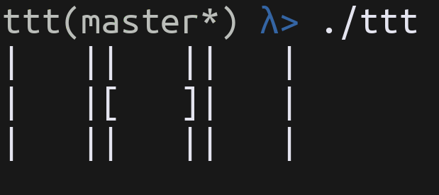

# Terminal TicTacToe



## How to start

```console
$ make
```

To play the game against a bot start the game with no flags:

```console
$ ./ttt
```

To play the game with a friend locally start the game with -l:

```console
$ ./ttt -l
```

## Controls

| key                                                 | description        |
|-----------------------------------------------------|--------------------|
| <kbd>w</kbd>,<kbd>a</kbd>,<kbd>s</kbd>,<kbd>d</kbd> | Move cursor        |
| <kbd>SPACE</kbd>                                    | Select Cell        |
| <kbd>r</kbd>                                        | Restart            |
| <kbd>q</kbd>                                        | Quit               |
